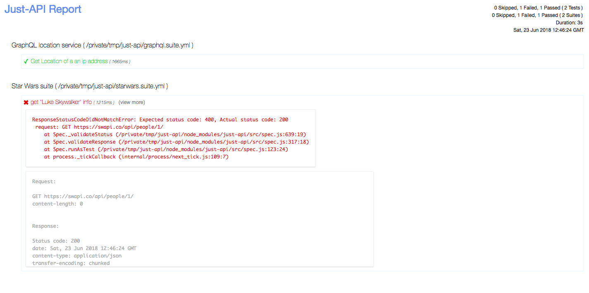

# Reporters


### Generating a report ###
Just-API has several built-in reporters, `json`, 'specs', 'html' etc.

When you need an HTML report, you can invoke just-api with the `--reporter` option

```sh
./node_modules/.bin/just-api --reporter html
```

#### A sample html report:



_Did you notice that the report has all request, response details for failed tests?_

### Generating reports in multiple formats ###

Just-API has the ability to generate reports in multiple formats.

When you need an HTML report and a JSON report too, you could do something like this

```sh
./node_modules/.bin/just-api --reporter html,json
```

This way you can generate reports in multiple formats for the same run.
